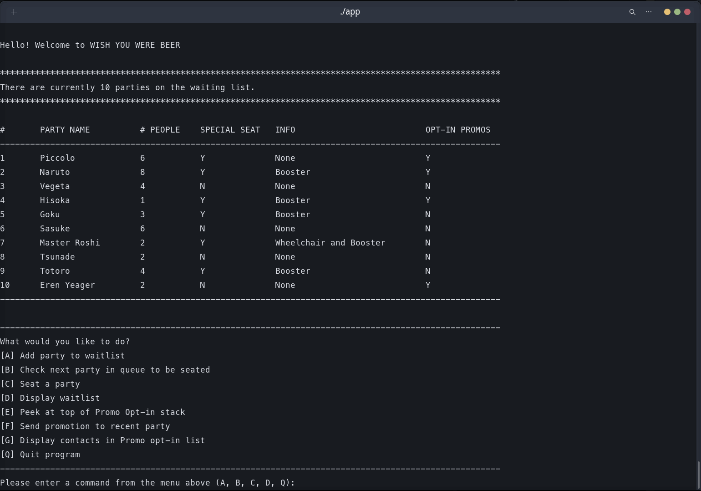

# A Restaurant Waiting List on the Command Line
This program keeps track of a restaurant's waiting list. It utilizes a circular linked list to build, traverse, add, and remove from the 
Queue of parties. A dynamic array keeps track of a Stack of people who opt in to be on the contact list for promotional material.


  

### Adding a party to the waitlist

  

### Checking next party in the waitlist

  

### Seating a party 

  

### Display list of contacts in the Promotions list

  

### Check most recent contact in Promotions list and send them promotional material

  


 ## Compiling and running code (with makefile):
Command to run on terminal:             
```
make
```
Command to execute program:             
```
./main
```
Command to remove .exe and files generated:        
```
make clean
```

